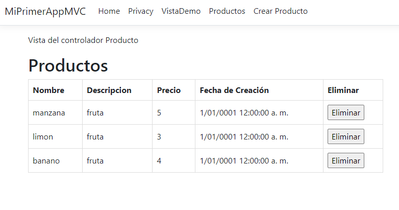

# C# POO
C# MVC POO en donde se agrega un producto y se elimina un producto

Curso de mvc C# en : [este link CRUD sqlite](https://www.youtube.com/watch?v=9JP3PSUb5cY&list=PL9Bm8IOGYHA3X6LjUEQAw9EGxTq5EAees&index=1)


Para crear proyectos mvc:
```
dotnet new mvc -o MiPrimeraAppMVC
```

Para run el proyecto , cambio simultaneo :
```
dotnet watch run 
```
<p align="center">
  
</p>

